# 20 oportunidades de marketing, creatividad e inteligencia artificial

Cada caso fue organizado con una búsqueda diferente y una captura de la vista completa de la oferta. Abre cada bloque para consultar imagen, enlace y análisis.

Trabajo 01 — Marketing & Creative Ops Manager

- **Búsqueda utilizada:** marketing creative operations manager
- **Puesto:** Marketing & Creative Ops Manager
- **Descripción y análisis:** Coordina campañas, procesos creativos, proveedores y medición de resultados; requiere organización y optimización de flujos.
- **Aplicación de IA/automatización:** Identificar tareas repetitivas, análisis, personalización o generación de contenido que puedan optimizarse con inteligencia artificial.
- **Qué revisar antes de postular:** requisitos, herramientas, modalidad, salario, idioma y fecha de publicación.
- **Enlace:** https://www.linkedin.com/jobs/search-results/?keywords=marketing%20creative%20operations%20manager&geoId=100508521&distance=25.0

Trabajo 02 — CRM Manager - Remote Work

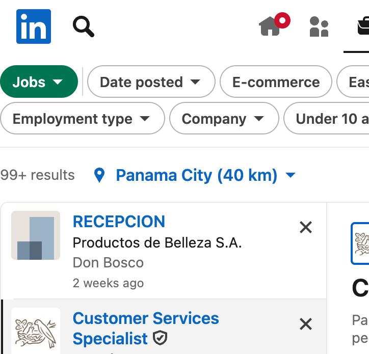

- **Búsqueda utilizada:** CRM marketing automation remote
- **Puesto:** CRM Manager - Remote Work
- **Descripción y análisis:** Gestiona segmentación, journeys, email marketing, automatizaciones y métricas de retención.
- **Aplicación de IA/automatización:** Identificar tareas repetitivas, análisis, personalización o generación de contenido que puedan optimizarse con inteligencia artificial.
- **Qué revisar antes de postular:** requisitos, herramientas, modalidad, salario, idioma y fecha de publicación.
- **Enlace:** https://www.linkedin.com/jobs/search-results/?keywords=CRM%20marketing%20automation%20remote&geoId=100508521&distance=25.0

Trabajo 03 — Lead Applied Scientist, Marketing

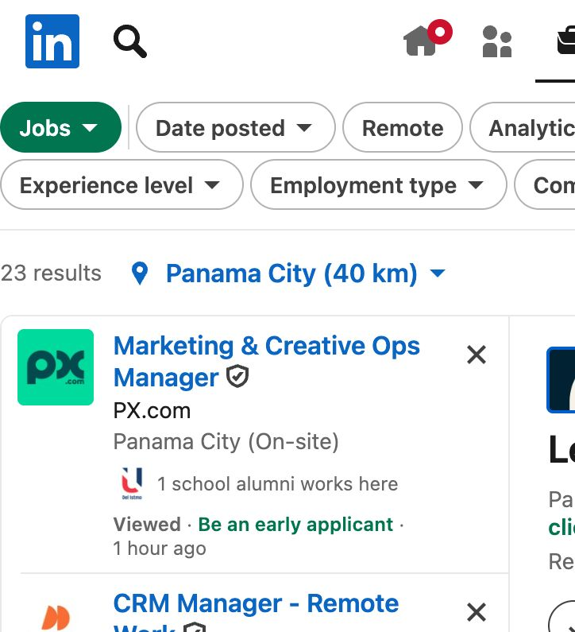

- **Búsqueda utilizada:** applied scientist marketing AI
- **Puesto:** Lead Applied Scientist, Marketing
- **Descripción y análisis:** Aplica modelos predictivos y experimentación para optimizar adquisición, conversión y crecimiento.
- **Aplicación de IA/automatización:** Identificar tareas repetitivas, análisis, personalización o generación de contenido que puedan optimizarse con inteligencia artificial.
- **Qué revisar antes de postular:** requisitos, herramientas, modalidad, salario, idioma y fecha de publicación.
- **Enlace:** https://www.linkedin.com/jobs/search-results/?keywords=applied%20scientist%20marketing%20AI&geoId=100508521&distance=25.0

Trabajo 04 — Staff Data Scientist, Marketing

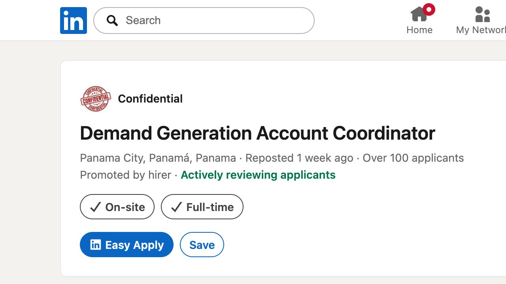

- **Búsqueda utilizada:** staff data scientist marketing
- **Puesto:** Staff Data Scientist, Marketing
- **Descripción y análisis:** Analiza grandes volúmenes de datos de marketing y crea modelos para decisiones de inversión y performance.
- **Aplicación de IA/automatización:** Identificar tareas repetitivas, análisis, personalización o generación de contenido que puedan optimizarse con inteligencia artificial.
- **Qué revisar antes de postular:** requisitos, herramientas, modalidad, salario, idioma y fecha de publicación.
- **Enlace:** https://www.linkedin.com/jobs/search-results/?keywords=staff%20data%20scientist%20marketing&geoId=100508521&distance=25.0

Trabajo 05 — Experto en Performance y Analytic

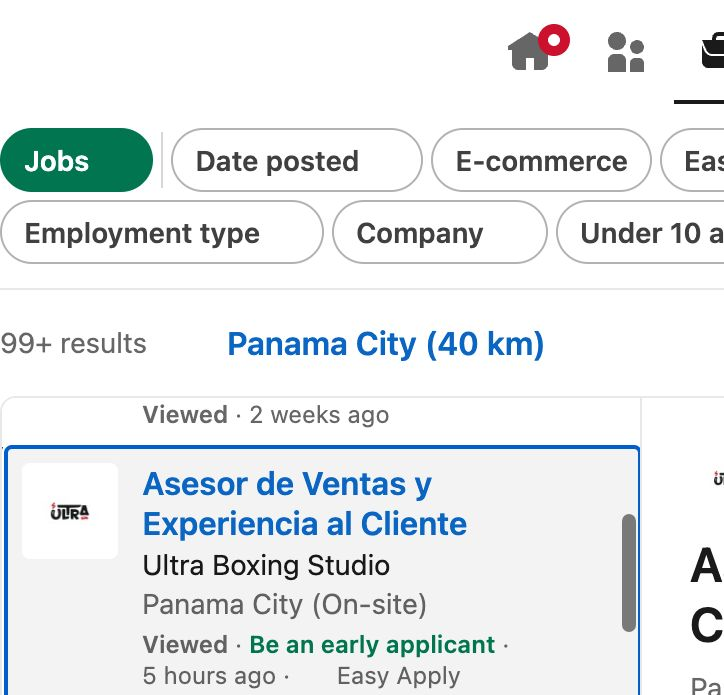

- **Búsqueda utilizada:** performance marketing analytics Panama
- **Puesto:** Experto en Performance y Analytic
- **Descripción y análisis:** Diseña campañas de performance, dashboards, atribución y optimización de conversiones.
- **Aplicación de IA/automatización:** Identificar tareas repetitivas, análisis, personalización o generación de contenido que puedan optimizarse con inteligencia artificial.
- **Qué revisar antes de postular:** requisitos, herramientas, modalidad, salario, idioma y fecha de publicación.
- **Enlace:** https://www.linkedin.com/jobs/search-results/?keywords=performance%20marketing%20analytics%20Panama&geoId=100508521&distance=25.0

Trabajo 06 — Data Scientist (Entry-Level)

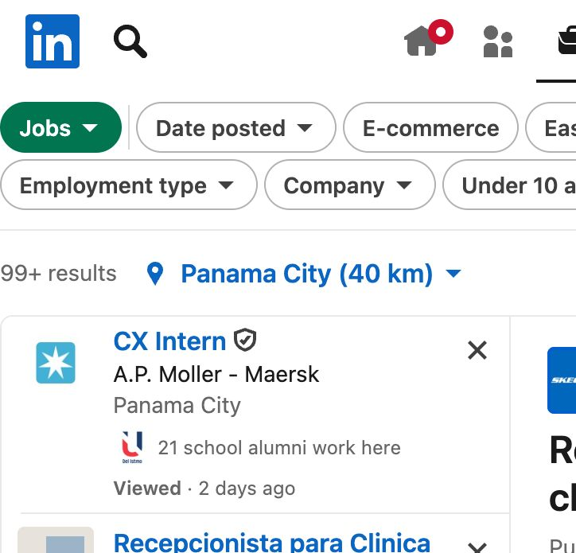

- **Búsqueda utilizada:** entry level data scientist marketing
- **Puesto:** Data Scientist (Entry-Level)
- **Descripción y análisis:** Apoya limpieza de datos, análisis exploratorio, visualizaciones y automatización de reportes.
- **Aplicación de IA/automatización:** Identificar tareas repetitivas, análisis, personalización o generación de contenido que puedan optimizarse con inteligencia artificial.
- **Qué revisar antes de postular:** requisitos, herramientas, modalidad, salario, idioma y fecha de publicación.
- **Enlace:** https://www.linkedin.com/jobs/search-results/?keywords=entry%20level%20data%20scientist%20marketing&geoId=100508521&distance=25.0

Trabajo 07 — Product Marketing Manager

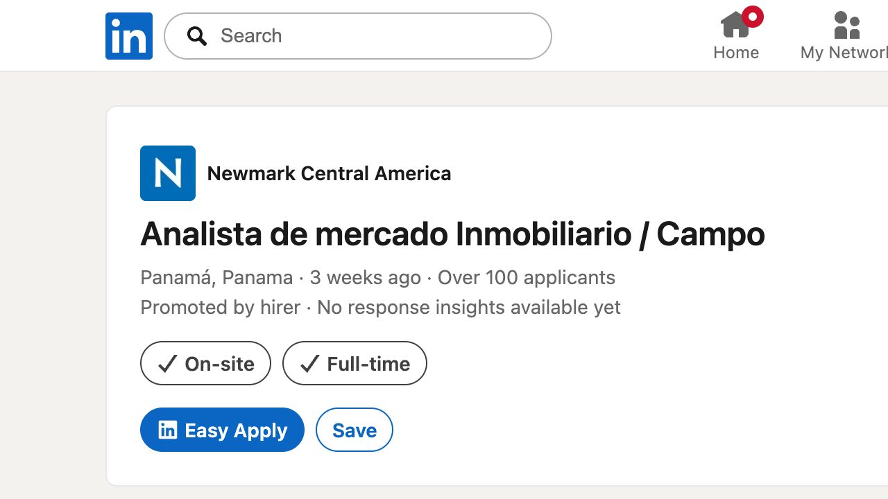

- **Búsqueda utilizada:** product marketing manager Panama
- **Puesto:** Product Marketing Manager
- **Descripción y análisis:** Conecta producto, mercado y clientes mediante posicionamiento, lanzamientos, contenido y análisis competitivo.
- **Aplicación de IA/automatización:** Identificar tareas repetitivas, análisis, personalización o generación de contenido que puedan optimizarse con inteligencia artificial.
- **Qué revisar antes de postular:** requisitos, herramientas, modalidad, salario, idioma y fecha de publicación.
- **Enlace:** https://www.linkedin.com/jobs/search-results/?keywords=product%20marketing%20manager%20Panama&geoId=100508521&distance=25.0

Trabajo 08 — Staff Applied Scientist, AdTech

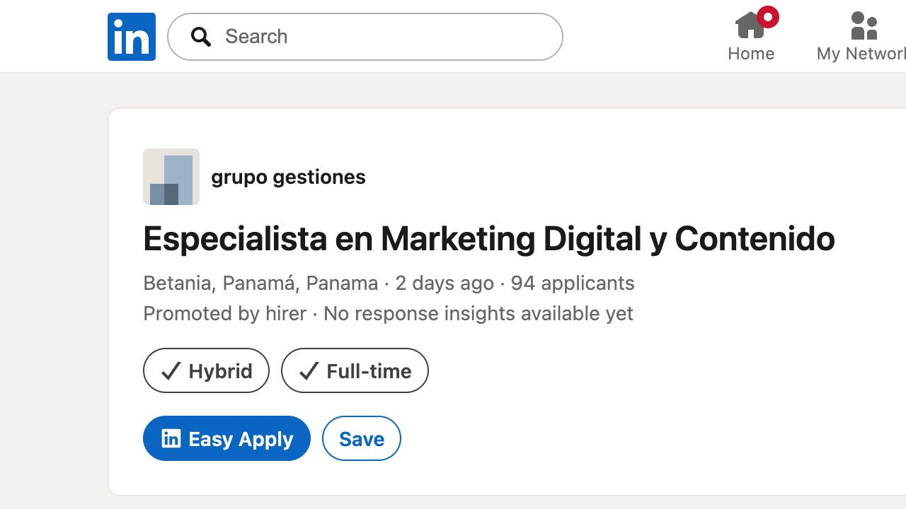

- **Búsqueda utilizada:** applied scientist adtech
- **Puesto:** Staff Applied Scientist, AdTech
- **Descripción y análisis:** Construye soluciones de IA para publicidad programática, segmentación y optimización de anuncios.
- **Aplicación de IA/automatización:** Identificar tareas repetitivas, análisis, personalización o generación de contenido que puedan optimizarse con inteligencia artificial.
- **Qué revisar antes de postular:** requisitos, herramientas, modalidad, salario, idioma y fecha de publicación.
- **Enlace:** https://www.linkedin.com/jobs/search-results/?keywords=applied%20scientist%20adtech&geoId=100508521&distance=25.0

Trabajo 09 — Lead Data Scientist, AdTech

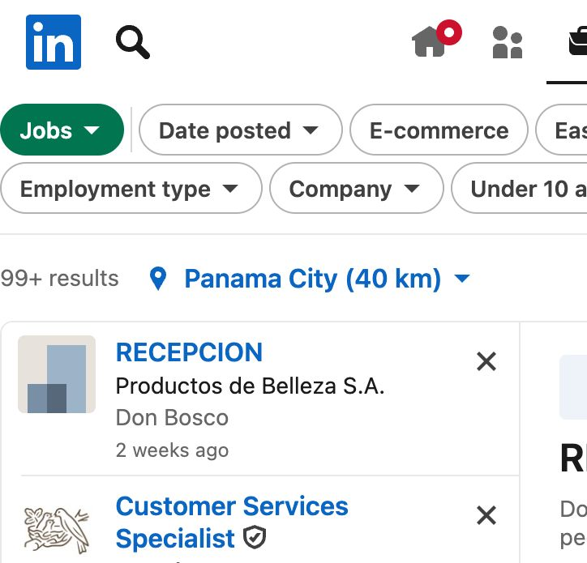

- **Búsqueda utilizada:** lead data scientist advertising technology
- **Puesto:** Lead Data Scientist, AdTech
- **Descripción y análisis:** Lidera modelos y experimentos para mejorar inventario publicitario, predicción y monetización.
- **Aplicación de IA/automatización:** Identificar tareas repetitivas, análisis, personalización o generación de contenido que puedan optimizarse con inteligencia artificial.
- **Qué revisar antes de postular:** requisitos, herramientas, modalidad, salario, idioma y fecha de publicación.
- **Enlace:** https://www.linkedin.com/jobs/search-results/?keywords=lead%20data%20scientist%20advertising%20technology&geoId=100508521&distance=25.0

Trabajo 10 — Agentic AI Solutions Architect

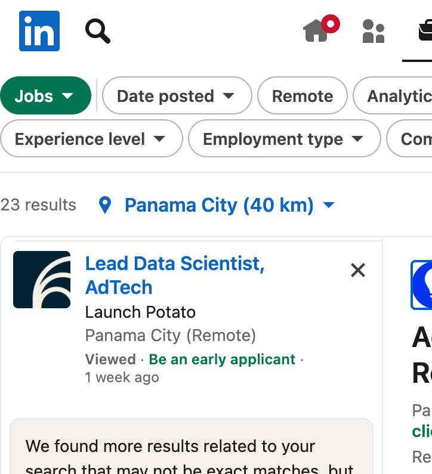

- **Búsqueda utilizada:** agentic AI solutions architect Latin America
- **Puesto:** Agentic AI Solutions Architect
- **Descripción y análisis:** Diseña soluciones con agentes, integraciones y automatizaciones de IA para resolver procesos empresariales.
- **Aplicación de IA/automatización:** Identificar tareas repetitivas, análisis, personalización o generación de contenido que puedan optimizarse con inteligencia artificial.
- **Qué revisar antes de postular:** requisitos, herramientas, modalidad, salario, idioma y fecha de publicación.
- **Enlace:** https://www.linkedin.com/jobs/search-results/?keywords=agentic%20AI%20solutions%20architect%20Latin%20America&geoId=100508521&distance=25.0

Trabajo 11 — Consumer Knowledge Specialist

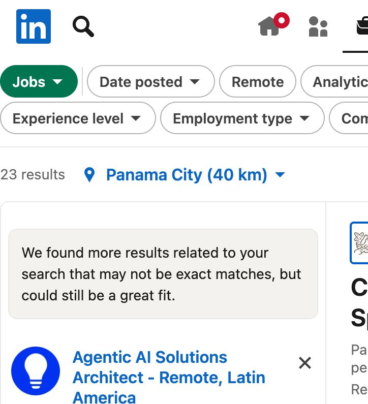

- **Búsqueda utilizada:** consumer insights marketing Nestle
- **Puesto:** Consumer Knowledge Specialist
- **Descripción y análisis:** Investiga consumidores, tendencias y comportamiento para apoyar estrategia de marca y portafolio.
- **Aplicación de IA/automatización:** Identificar tareas repetitivas, análisis, personalización o generación de contenido que puedan optimizarse con inteligencia artificial.
- **Qué revisar antes de postular:** requisitos, herramientas, modalidad, salario, idioma y fecha de publicación.
- **Enlace:** https://www.linkedin.com/jobs/search-results/?keywords=consumer%20insights%20marketing%20Nestle&geoId=100508521&distance=25.0

Trabajo 12 — Market Share Data Specialist

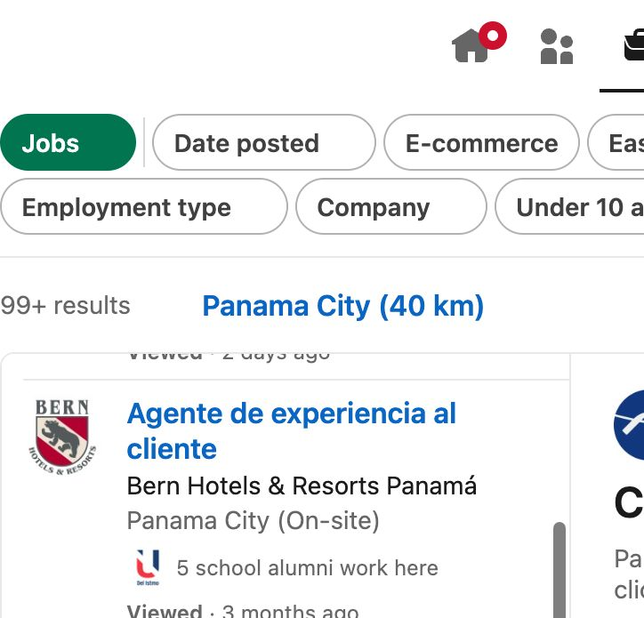

- **Búsqueda utilizada:** market share data analyst marketing
- **Puesto:** Market Share Data Specialist
- **Descripción y análisis:** Monitorea participación de mercado, fuentes de datos y reportes para decisiones comerciales.
- **Aplicación de IA/automatización:** Identificar tareas repetitivas, análisis, personalización o generación de contenido que puedan optimizarse con inteligencia artificial.
- **Qué revisar antes de postular:** requisitos, herramientas, modalidad, salario, idioma y fecha de publicación.
- **Enlace:** https://www.linkedin.com/jobs/search-results/?keywords=market%20share%20data%20analyst%20marketing&geoId=100508521&distance=25.0

Trabajo 13 — Marketing Strategy Specialist

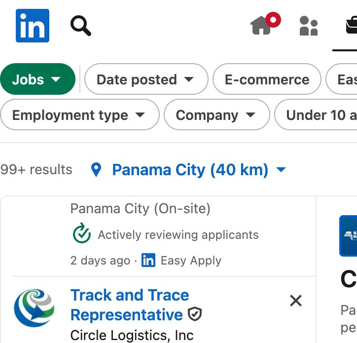

- **Búsqueda utilizada:** marketing strategy remote LATAM
- **Puesto:** Marketing Strategy Specialist
- **Descripción y análisis:** Desarrolla estrategia, investigación, contenido y planes de crecimiento para clientes de educación superior.
- **Aplicación de IA/automatización:** Identificar tareas repetitivas, análisis, personalización o generación de contenido que puedan optimizarse con inteligencia artificial.
- **Qué revisar antes de postular:** requisitos, herramientas, modalidad, salario, idioma y fecha de publicación.
- **Enlace:** https://www.linkedin.com/jobs/search-results/?keywords=marketing%20strategy%20remote%20LATAM&geoId=100508521&distance=25.0

Trabajo 14 — GERENTE DE GROWTH MARKETING

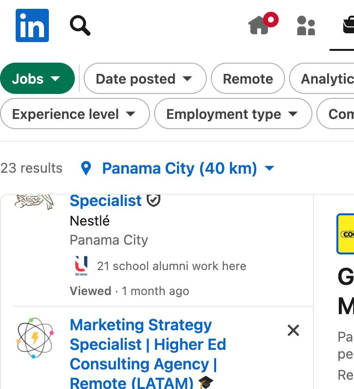

- **Búsqueda utilizada:** growth marketing manager Panama
- **Puesto:** GERENTE DE GROWTH MARKETING
- **Descripción y análisis:** Define adquisición, embudos, experimentos, contenido y canales pagados/orgánicos para crecer ingresos.
- **Aplicación de IA/automatización:** Identificar tareas repetitivas, análisis, personalización o generación de contenido que puedan optimizarse con inteligencia artificial.
- **Qué revisar antes de postular:** requisitos, herramientas, modalidad, salario, idioma y fecha de publicación.
- **Enlace:** https://www.linkedin.com/jobs/search-results/?keywords=growth%20marketing%20manager%20Panama&geoId=100508521&distance=25.0

Trabajo 15 — Digital Account Manager | PPC & SEO

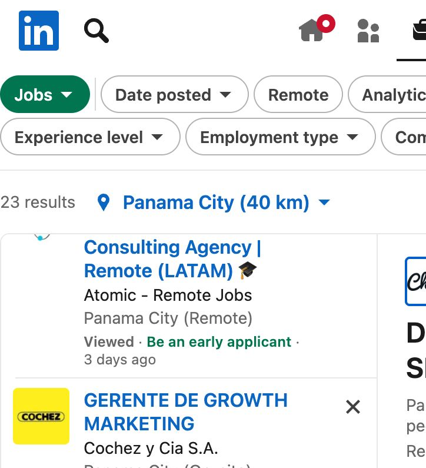

- **Búsqueda utilizada:** digital account manager PPC SEO
- **Puesto:** Digital Account Manager | PPC & SEO
- **Descripción y análisis:** Gestiona cuentas, campañas PPC, posicionamiento SEO, reportes y relación con clientes.
- **Aplicación de IA/automatización:** Identificar tareas repetitivas, análisis, personalización o generación de contenido que puedan optimizarse con inteligencia artificial.
- **Qué revisar antes de postular:** requisitos, herramientas, modalidad, salario, idioma y fecha de publicación.
- **Enlace:** https://www.linkedin.com/jobs/search-results/?keywords=digital%20account%20manager%20PPC%20SEO&geoId=100508521&distance=25.0

Trabajo 16 — Especialista de Data y Analítica

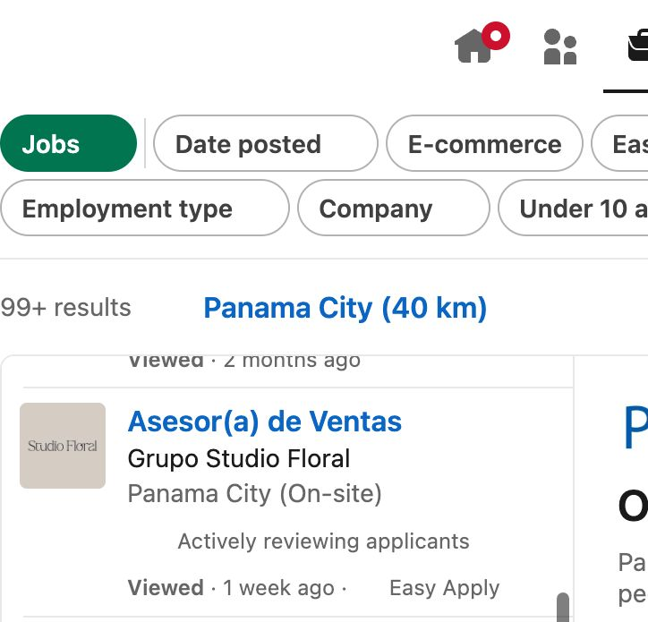

- **Búsqueda utilizada:** data analytics specialist Panama
- **Puesto:** Especialista de Data y Analítica
- **Descripción y análisis:** Convierte datos en indicadores, dashboards y recomendaciones para áreas comerciales y de marketing.
- **Aplicación de IA/automatización:** Identificar tareas repetitivas, análisis, personalización o generación de contenido que puedan optimizarse con inteligencia artificial.
- **Qué revisar antes de postular:** requisitos, herramientas, modalidad, salario, idioma y fecha de publicación.
- **Enlace:** https://www.linkedin.com/jobs/search-results/?keywords=data%20analytics%20specialist%20Panama&geoId=100508521&distance=25.0

Trabajo 17 — Business Analyst

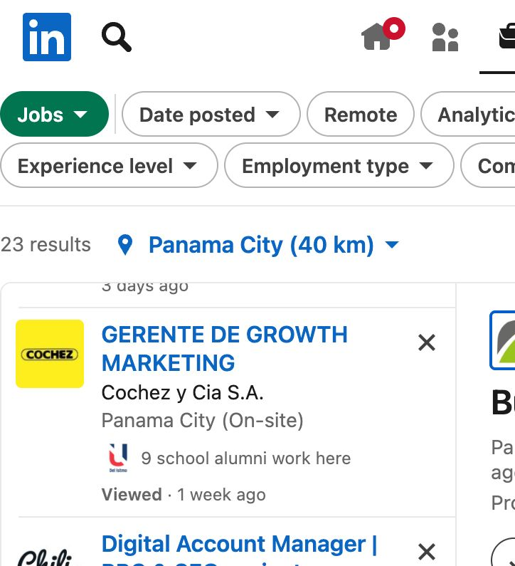

- **Búsqueda utilizada:** business analyst fintech Panama
- **Puesto:** Business Analyst
- **Descripción y análisis:** Analiza procesos, métricas y necesidades del negocio para proponer mejoras y automatizaciones.
- **Aplicación de IA/automatización:** Identificar tareas repetitivas, análisis, personalización o generación de contenido que puedan optimizarse con inteligencia artificial.
- **Qué revisar antes de postular:** requisitos, herramientas, modalidad, salario, idioma y fecha de publicación.
- **Enlace:** https://www.linkedin.com/jobs/search-results/?keywords=business%20analyst%20fintech%20Panama&geoId=100508521&distance=25.0

Trabajo 18 — Demand Generation Account Coordinator

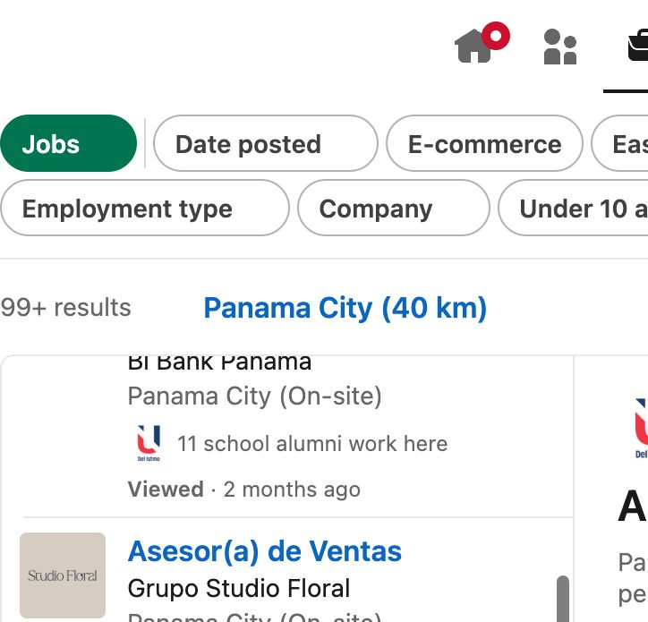

- **Búsqueda utilizada:** demand generation marketing coordinator
- **Puesto:** Demand Generation Account Coordinator
- **Descripción y análisis:** Apoya generación de demanda, campañas B2B, seguimiento de leads y coordinación de contenidos.
- **Aplicación de IA/automatización:** Identificar tareas repetitivas, análisis, personalización o generación de contenido que puedan optimizarse con inteligencia artificial.
- **Qué revisar antes de postular:** requisitos, herramientas, modalidad, salario, idioma y fecha de publicación.
- **Enlace:** https://www.linkedin.com/jobs/search-results/?keywords=demand%20generation%20marketing%20coordinator&geoId=100508521&distance=25.0

Trabajo 19 — Marketing Automation Specialist

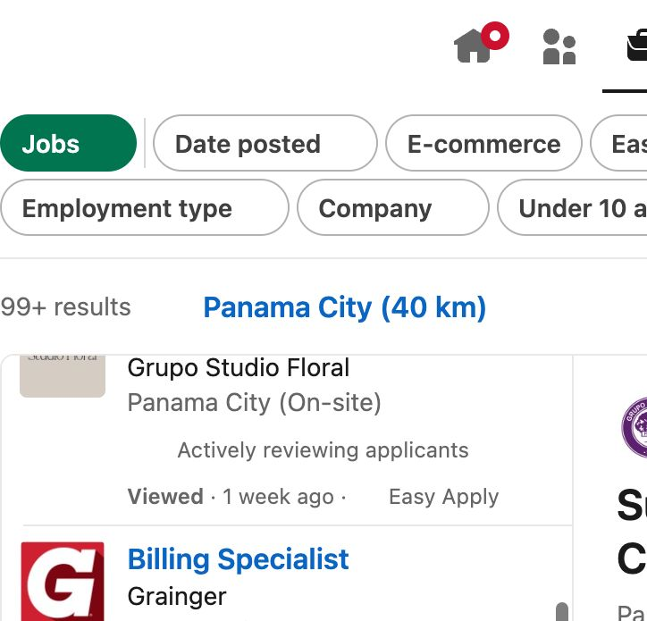

- **Búsqueda utilizada:** marketing automation specialist AI tools
- **Puesto:** Marketing Automation Specialist
- **Descripción y análisis:** Automatiza campañas, integraciones, lead scoring y reportes usando herramientas digitales e IA.
- **Aplicación de IA/automatización:** Identificar tareas repetitivas, análisis, personalización o generación de contenido que puedan optimizarse con inteligencia artificial.
- **Qué revisar antes de postular:** requisitos, herramientas, modalidad, salario, idioma y fecha de publicación.
- **Enlace:** https://www.linkedin.com/jobs/search-results/?keywords=marketing%20automation%20specialist%20AI%20tools&geoId=100508521&distance=25.0

Trabajo 20 — AI Marketing Specialist

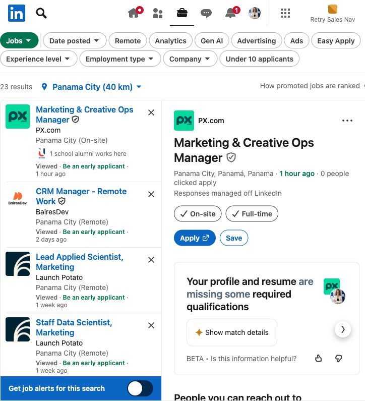

- **Búsqueda utilizada:** AI marketing specialist content automation
- **Puesto:** AI Marketing Specialist
- **Descripción y análisis:** Integra IA en investigación, creación de contenido, personalización y optimización de campañas.
- **Aplicación de IA/automatización:** Identificar tareas repetitivas, análisis, personalización o generación de contenido que puedan optimizarse con inteligencia artificial.
- **Qué revisar antes de postular:** requisitos, herramientas, modalidad, salario, idioma y fecha de publicación.
- **Enlace:** https://www.linkedin.com/jobs/search-results/?keywords=AI%20marketing%20specialist%20content%20automation&geoId=100508521&distance=25.0

## Checklist

- [x] 20 búsquedas diferenciadas.
- [x] 20 bloques desplegables.
- [x] Captura completa por caso.
- [x] Descripción y análisis específico por puesto.

